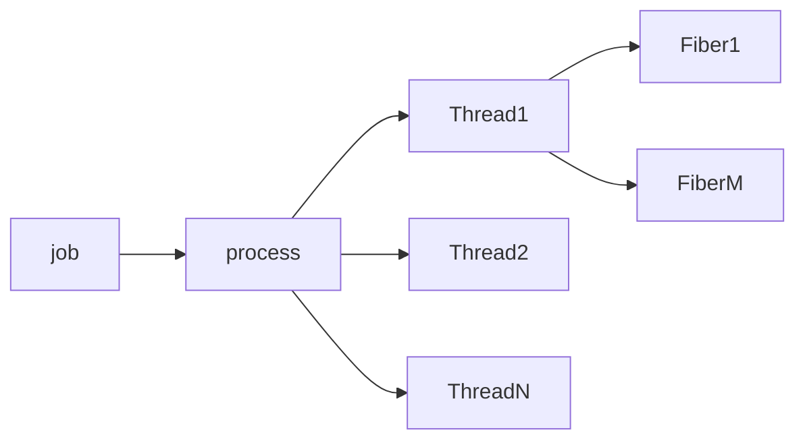
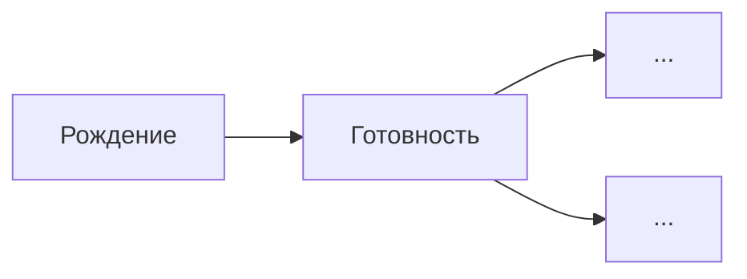
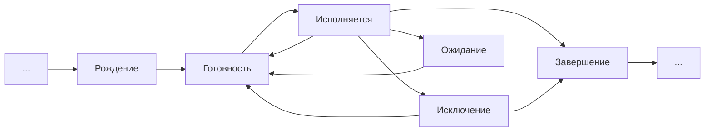
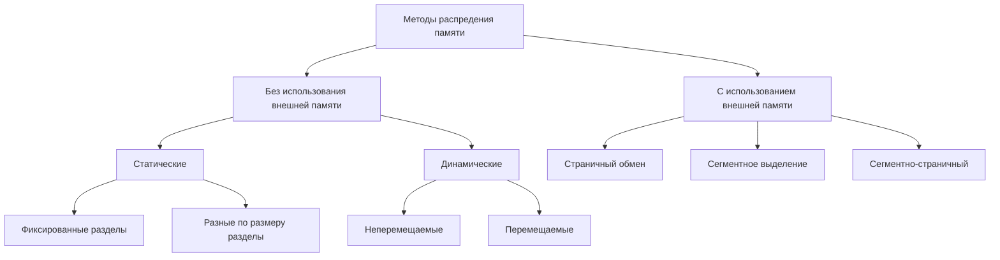

# ОСИ
## Курс Маятина 
Курс не нацелен на написание системного ПО самостоятельно, вместо этого будем разрабатывать ПО, которое будет работать под управлением системы. 

Сначала чуть больше половины -- классический курс ОС. Поговорим про процессы, ядра, архитектуру, процессы, планирование, проблемы синхронизации процессов,  тупики и проблемы, связанные с тупиками, выделение памяти, файловые системы. 

Вторая часть -- более современные вещи: проблемы синхронизации на различных узлах, распределённые системы, облака, безопасность. 


## Первая лекция
Программные диспетчеры появились в конце 40-ых, начале 50-ых годов. Сначала код каждый раз загружался заново в память, программа выполнялась, код выгружался. 
Позже появились идеи выделить некоторую часть RAM, чтобы загрузить туда часть часто используемых инструкций (микропрограмм). Появилась простейшая линковка. Дальше оказалось, что не очень удобно, когда это хранится в статических адресах, но на тот момент всё размещалось статически. 
Когда выяснилось, что RAM всегда не хватает, решили использовать spooling, чтобы загружать данные в RAM параллельно. Появился контроллер, контролирующий управление данными. Появился механизм interrupt. 

Позже появилось понятие "пакет" -- совокупность программных компонентов и, возможно, данных, связанных с ними. При этом становится логичным, чтобы storage хранила последовательность пакетов, которые потом будут выполнены. Появляется очередь. Поэтому начинают появляться первые планировщики. 


[Фоточка-картиночка архитектуры на втором этапе](https://lh3.googleusercontent.com/OhKCqwiDnW6cbS2WBOYTnQJfq3RGMOIAD1mek4Y5zgw-3RkT8f-6HOhMvXeoIIzUOoAKC2krJWP-)

### Второй этап
Этап многозадачных операционных систем. Процесс выполнения начинает разбиваться на две явные фазы: обработка данных и операции ввода-вывода. 
Появляется концепция разделения времени. Сложнее оказалось разделить память. После появления этой проблемы появилась концепция виртуальной памяти. Появляется механизм защиты памяти и появления привилегированного режима. Концепция виртуальной машины для программ.

В 1963 году появляется MCP. Её в описании назвали уже "операционной системой". Она поддерживала всё, описанное выше, мультипроцессорную обработку. 

### Третий этап
Сетевые операционные системы. 
В те году AT&T соединил огромное количество городов сетью. 
Появляется понятие "Терминал". 
Идентификация -> аутентификация -> авторизация. Данная концепция появляется, чтобы разграничить права доступа. 
Однако возникает проблема простоя некоторых узлов. Появляется понятие компьютерной сети. В конце 60-ых завершается третий этап. 

### Четвёртый этап
Появление "мобильных ОС". До этого момента операционная система создавалась **уникально** для каждого компьютера. На этом этапе появилось абстрагирование ПО от конкретных компьютеров. 
Появление UNICS. В 1967 году запускается проект -- multics (?). Кенн Томпсон решает, что неплохо было бы перенести принципы этой ОС на все компьютеры. Для этого нужен был язык высокого уровня. 
Сначала пишут первую версию к первому января 1970 года целиком на ассемблере. 
Создаётся язык B, язык высокого уровня. На нем создаётся компилятор и начинает переписываться ядро ОС. Это происходит где-то к 1972 году, second edition. 
Разрабатывается язык С. Для него сначала пишут компилятор, затем прямо на С пишут ядро ОС. В 1975 году появляется полностью на C edition five и имеющая встроенный компилятор С. UNICS становится UNIX
В последней седьмой версии появляется предшественник Bash'a.
Из-за законодательства США появляется ситуация, когда AT&T не могут защитить патентами код UNIX. Пользуясь теми моментами, когда код ещё не был защищён, университеты США (в частности, Беркли) забирает себе исходный код UNIX и начинает развивать собственную ветку. Создаётся собственная дочерняя компания BSD. Противник Беркли, Стэнфорд, создаёт SUN, которое создаёт SUN OS, на котором работает ЦДО ИТМО. В это время AT&T удаётся закрыть код UNIX патентами. 

В восьмидесятые годы наступает расцвет ОС. Появление проекта Darwin, из которого позже разовьётся mac OS. 
Появляется идея, связанная со свободой. Все начинают понимать, что развитие ОС тормозится патентами. Ричард Столлман, преподаватель MIT, начинает продвигать идею создания ОС, которую невозможно было бы закрыть патентами. Мы делаем код, публикуем его под такой лицензией, чтобы если ты взял наш код и хотя бы как-то дополнил его, ты обязан выпустить свой продукт под этой же лицензией. 
Разработчики, включая Столлмана, переписывают компилятор С полностью с нуля, чтобы создать полностью свободный компилятор. Надо решить непростую задачу -- написать ядро. Танненбаум стартует свой проект minix, выступает с докладом про него. Во время доклада возникает спор между молодым аспирантом из аудитории и Танненбаумом. Этим аспирантом был ~~Эйнштейн~~ Линус Торвальдс. 
Создаётся GNU is not unix. Появление GNU/Linux. 

## Вторая лекция
/* куча нудных слов непонятно о чём (ни о чём)  */
Задача оптимизации процессов, в широком смысле, не может быть решена, поскольку мы не можем оценить оптимальность потраченного времени из-за затраты ресурсов системы на мониторинг, куда было потрачено время.
/* куча нудных слов и история про аэропорт */

Задачи ОС: 
(5 пунктов, которые я пропустил)

Функции ОС:
(1 пункт, который я тоже пропустил)

У меня есть некоторое количество мощностей и критериев K, которым я хочу удовлетворять. Введём __суперкритерий__ K с крышечкой, который будет некоторой свёрткой всех критериев с некоторыми коэффициентами. 

Для систем реального времени используют __условный критерий__: я пытаюсь найти максимум от некоторой свёрткой, при условии, что некоторый конкретный критерий находится в некоторых границах. 

Для того, чтобы найти эти коэффициенты при критериях, используют цикл __PDCA__ (Plan--Do--Check--Act).

ОС проектируются десятилетиями и на десятилетия, поэтому практически отсутствует возможность прогнозирования, в каких условиях она будет работать. 

### Уровень управления процессами
С точки зрения ОС процесс -- это структура данных. 

На этом слова кончились, дальше обещано что-то адекватное

## Третья лекция
### Архитектура операционной системой
Принципы:
1. Модульная организация
2. Функциональная избыточность 
3. Функциональная избирательность
4. Выделение хотя бы двух пространств: __user space__ и __kernel space__

**Привилегия** -- возможность доступа к физическим адресам памяти, а не приоритет в каких-либо операциях. Только ядро в привилегированном режиме имеет доступ к физическим устройствам и памяти. 
Кроме того, что ядро должно быть привилегированно, оно ещё должно быть __резидентно__, т.е. полностью и всегда расположено в оперативной памяти. 

Дальше возник спор: а что тогда должно быть в ядре? 
N.B. Ядро linux на момент написания данного конспекта включает приблизительно 8млн строк кода. 

Самый первый вид, о котором мы говорим -- __монолитное ядро__. Ядро особо не структурировано в плане доступа. Любая процедура может вызвать и передать данные любой другой процедуре. Тем не менее, даже в монолитной структуре выделяют три слоя, которые абстрагированы друг от друга:
1. Main program 
2. Services procedures 
3. Utilities

__Системный вызов__ -- это обращение пользовательской программы к ядру ОС с требованием предоставить дополнительные ресурсы или выполнить привилегированную операцию.
Как это устроено: у каждого приложения, которое запускается, выделяется некоторая область памяти, в которой находятся некоторые параметры. 
Дальше, если необходим системный вызов, программа заполняет это пространство и делает программное прерывание. Система это замечает, смотрит на номер системного вызова, делает валидацию параметров, после чего main program определяет, какой сервис будет отвечать за выполнение системного вызова. 

Утилиты, по большому счёту, это драйверы. Утилиты -- это то, что взаимодействует непосредственно с железом. 

Какие минусы быстро возникли:
* если я хочу что-то поменять в работе ОС, то, как минимум, это перезапуск ядра, как максимум -- перекомпиляция ядра
* что-то ещё, но я провафлил


Плюсы:
* никаких накладных расходов -> быстродействие 
* максимальная надёжность
/* стори про сервак факультета и FREE BSD */

### Многослойное ядро
Его иногда считают подмножеством монолитных ядер. Действительно, оно остаётся монолитным, просто количество слоёв увеличивается и появляется некоторое количество абстракций, которое позволяет переписывать отдельные уровни без влияния на остальные. 

Уровень аппаратной поддержки ядра:
* работа с прерываниями
* работа с контекстом 

Следующий уровень: **Hardware Abstraction Layer (HAL)**
Вы должны сделать абстрагирования всякого кода, связанного с принятием решений и тд, от платформы. Взаимодействие двух этих уровней позволяет работать системам на разных платформах. То, то раньше было утилитами, во многом переехало на HAL уровень. 

За HAL'ом идёт следующий уровень, который обычно называют **базовые механизмы ядра**. Будем рассматривать его в совокупности со слоем **менеджеров ресурсов**. 
Мы решили, что мы выделяем данному процессору некоторое адресное пространство. Теперь нужно его выделить. Эти процессы лучше разбить на разные уровни, потому что мы хотим, чтобы мы могли менять менеджер ресурсов (алгоритмы, подходы и тд), а исполнительский уровень не хотелось бы трогать. 

Последний слой: **слой системных вызовов**
Это тот слой, который нам обеспечивает взаимодействие находящегося снаружи программного обеспечения с нашим ядром. Сейчас этот слой предоставляет не одну точку входа (main program), а среды окружения. 

Где мы победили:
* можем переписывать отдельные слои

Где мы **не** победили:
* по прежнему съедаем большое количество памяти
* без перезапуска всё ещё сложно заменить что-то в ядре

### Новые концепции
Выполнение части задач на других аппаратных узлах. В чём проблемы? Менеджер ресурсов один. Он привязан к железу и не может ничего делать с другими узлами. 
Как выйти из этой ситуации? Нужно уходить из ядра, однако это сломает безопасность. Кроме того, это вызовет накладные расходы. 
Таким образом появилась **микроядерная архитектура**.
##

У меня есть user mode и kernel mode. 

В kernel mode я оставлю:
* базовые механизмы
*  HAL
* аппаратную поддержку

 В user mode разместим сервера. 
 
 [Схемка многоядерной архитектуры](https://lh3.googleusercontent.com/bjD2EEE3S5gjq--XqWFnS_MrAJ9cD_hy4UiP43rBgGrXAzw6jmEr7XQ-aryatQ6GnZN6F2n3p1km "Схема микроядерной архитектуры &#40;справа затесалась многослойная&#41;")

Проблема: мы часто не используем сервера, но они продолжают висеть в системе и жрать ресурсы. Что делать?
Не использую сервер печати? В файл подкачки его. Не использую сервер сети? В файл подкачки. Разница в 60-70 раз по ресурсам. 
Следующее преимущество подобного подхода: возможность создания распределённых систем. 

Чем за это заплатили? 
* производительностью 
* чем-то ещё

### Наноядро
По факту, в ядре остаётся только обработка прерываний. Всё остальное вынесено за пределы ядра, а ядро просто обрабатывает прерывание. 
Где и зачем это применяется: так работает виртуализация (домашняя). При серверной виртуализации используются другие подходы, потому что иначе слишком высокие накладные расходы. 

### Экзоядерная архитектура (инвертированная)
В ней мы в ядре оставляем планировщики и только их. Тогда мы теряем жёсткость контроля над оборудованием. Что мы приобретаем? Возможность работы при нестабильности железа. Любой сбой любого драйвера? Ничего страшного. Правда мы не гарантируем никакой консистентности и сохранности данных. 

##
Все реальные ОС имеют **гибридные ядра**, поэтому большинство из них называют **гибридными**. 
**windows** -- в чистом виде гибридная архитектура
**linux** -- монолитное ядро, но с оговорками (многопоточное ядро, отдельные программные компоненты, в том числе на HAL уровне, могут быть заменены без перезагрузки при помощи заглушек)
**Mac OS** -- микроядро

## Четвёртая лекция
### Процесс
Попытаемся разобраться, что такое процесс и что такое поток. 

**Процесс** -- совокупность набора исполняющихся команд, ассоциированных с ним ресурсов и текущего статуса их выполнения, находящаяся под управлением ОС. 

Нельзя ставить чёткое соответствие между программами и процессами. Например, одна программа может создавать больше одного процесса. В то же время, один процесс может быть совокупностью нескольких программ. 

Что значит ".... и ассоциированных с ним ресурсов". Если я запущу один и тот же файл несколько раз, набор исполняемых команд будет тот же самый, но ведь это другой процесс. Значит, он будет отличаться ресурсами, хотя бы адресными пространствами и файловыми дескрипторами. В UNIX любой процесс на старте получит три дескриптора: `stdin`, `stdout`, `stderr` с номерами 0, 1 и 2 соответственно. Ещё ассоциируются обычно сетевые порты (сокеты) и тд. 

"... и текущего статуса исполнения". С точки зрения существования ОС каждый процесс характеризуется его состоянием. Даже на уровне интуиции понятно, что процесс может либо исполняться, либо находиться в ожидании какого-либо процесса, либо находится в зомби-состоянии и тд. Этот процесс характеризуется этим состоянием, которое характеризуется его контекстом (состоянием регистров в последний момент исполнения). 

Наконец, последняя часть определения. ОС имеет монополию над процессами, соответственно, только она имеет полную власть над ними. 

20 лет назад стало очевидно, что многие задачи с большими массивами данных прекрасно распараллеливаются. Возникает вопрос, как разделить этот массив эффективно в условиях, когда мы не знаем, какие ресурсы будут нам доступны. Хочется, чтобы процессы по одному выбирали просто какой-то следующий доступный блок данных, когда потребуется. Тогда мы действительно получим преимущество по скорости. 

Появляется противоречие с концепцией изоляции процессов друг от друга. Для того, чтобы это исправить, сделали вполне понятный ход: давайте разрешим внутри одного процесса существовать нескольким потокам исполняющихся команд. 
Тогда мы переходим от понятия "процесса" к понятию **потока**. Сегодня любая ОС работает следующим образом: немного изменилось определение процесса. Сегодня процесс -- это контейнер, в котором существует как минимум один поток исполнения, в котором существует уже поток исполнения команд. 
**Процесс** -- контейнер ресурсов для совокупности потоков. Теперь любая ОС осуществляет планирование на уровне последних. 


Система имеет монополию управления потоков. В ответ на запрос пользователей создаются отдельные волокна (fiber), которые позволяют управлять планировкой времени на уровне волокон. Линукс отказался от этой идеи с самого начала, MS же поддерживает. 
Дальше началась развиваться концепция, которая была хорошо забытым старым, потому что даже трёх уровней стало не хватать. Появился **job** (group). 
Например, есть chrome. У него много тяжелых вкладок, на которых много тяжёлого кода. Хотелось бы, чтобы вкладки выполнялись в разных процессах, чтобы краш одной вкладки не приводил к крашу браузера. Так же, если бы браузер использовал только один процесс, можно было бы спереть данные из одной вкладки через другую. Если у меня открыто 100 вкладок хрома и одна вкладка ворда, ворд получит 1/101 процессорного времени. Несправедливо. Так появился механизм **квантирования**. Грубо говоря, "Вот тебе определённое количество времени, больше не дам, сколько бы процессов ни было". 
Такова общая модель. 

### 
Выделим, какие функции выполняет ОС для управления процессами. 
1. Создание процесса. 

Процесс -- структура данных ядра, т.е. создать процесс значит создать структуру данных. Есть принципиальное различие между созданием процессов в линуксе и винде. 

В линуксе они рождаются деревом планирования. Первый процесс `init` стартует ядро, 
Ядро запускает первый процесс `init`, все остальные процессы порождаются процессом `init`. Любой процесс хранит свой `pid` и `parent pid`. Зачем это нужно? Во-первых, в такой модели удобно обеспечить анализ всех дочерних процессов. Любой процесс, завершаясь, посылает родителю информацию о том, что он завершается, дальше этот сигнал можно как-то обработать. 
Естественный минус -- что произойдёт, если у меня работает дочерний процесс и у меня крашнулся родительский? Теперь дочерний процесс стал осиротевшим (да, это официальный термин). Были попытки починить это усыновлением (и это, как ни странно, тоже). Это требует большого количество ресурсов для обработки целых двух уровней процессов, а не одного. Поэтому сейчас работает другая модель: если у нас теряется связь с родителем, то всех таких потомком усыновляет `init`. Почему это так? Просто потому что `init` имеет обработчик всех сигналов, которых конечное число (кажется, 64, только два из них пользовательские). 
/* какие-то слова */
Зомби-процессом называется процесс, который завершился, родитель которого тоже завершился, но до него. Он не может получить информацию о том, что родительский процесс крашнулся. Он не может отослать родителю код возврата. Процесс уже не может жить и не может умереть. Чем они плохи? Они занимают дескриптор. Если аптайм каких-нибудь семь лет, зомби-процессы могут сожрать все pid'ы. 

В windows всё устроено по другому. Он использует "государственную модель". Есть диспетчер процессов, который управляет абсолютно всеми процессами. Когда процесс хочет создать дочерний, он делает системный вызов. Ядро вызывает сервис диспетчера процессов, он создаёт новый процесс и родителю сообщает просто идентификатор дочернего процесса родительскому. В линуксе создание процесса это два системных вызова: `fork()` и `exec()`.  Что это нам позволяет? На базовом уровне обеспечить серьёзную безопасность, потому что дочерний процесс не может получить больше данных, чем было у родителя. 
В винде дочерний процесс запрашивает те данные, которые ему нужны, и диспетчер процессов легко их ему выдаёт. Зато не бывает зомби-процессов.

2. Обеспечиваем процессы и потоки необходимыми ресурсами

Бывает первичное обеспечение процесса и последующее. 
Здесь тоже есть принципиальная разница: винда гарантирует каждому процессу чистое и независимое адресное пространство. Линукс клонирует родительское. Раньше это клонирование приводило к достаточно медленному созданию процесса. 

3. Изоляция процесса

Она происходит на нескольких уровнях. 
Во-первых, на уровне аппаратной поддержки ядра. Там реализована защита памяти: при каждом обращение к памяти происходит оценка, в чьё адресное пространство происходит обращение и срабатывает прерывание, если лезете не в свою память. 
В линуксе создана достаточно простая модель: существует каталог ```/var/lock```. Там находится символическая запись файла. Процесс создаётся, смотрит, есть ли файл в этом каталоге. Если есть -- обращение не позволено. 

4. Диспетчеризация потока

Смена потока на какой-нибудь другой. Она происходит в три этапа: сохранить регистровый контекст уходящего потока, загрузить новый регистровый контекст, сменить статус потока.
Процедура смены статуса должна быть атомарной. Здесь происходит коллизия с прерыванием. Поэтому большинство ОС использует переход в однопрограммный режим. Поэтому большинство процессоров поддерживают очень опасный режим игнорирования прерываний. Чем это плохо? Тем, что если я плохо написал код между этими двумя процессами, то я уже ничего не сделаю, потому что процессор игнорирует прерывание. 

6. Организация межпроцессного взаимодействия

Мы хотим, чтобы процессы были изолированны, но при этом могли обмениваться данными. Для этого нужен посредник. ОС гарантирует только одно: другой процесс получит сигнал, который перебросит ОС, а дальше он уже решает, обрабатывать его или нет. 
На примере линукса, существуют именованные каналы. Когда вы запускаете command1 | command2. Между ними существует буффер, чтобы обеспечить взаимодействие. На самом деле, этот буффер находит в пространстве процесса, который породил запуск этих подпроцессов. Что делать, если я нахожусь в изолированном процессе? Будет создан именованный канал. Будет создан "файл", в который одна программа пишет, а другая читает. Но если бы файл был физическим. это было бы очень долго. 

7. Синхронизация процессов и потоков

У меня есть два процесса, которые оба хотят использовать ресурс, который нельзя разделить. Как фиксить? ~вилкой~ Потребовалось десять лет, чтобы разработать теорию этого переключения. Дейкстра был одним из тех, кто смог решить эту проблему, но на тот момент его идея семафоров была нереализуема. 
Дальше, даже если я даже научился делать так, чтобы один неразделяемый ресурс давался одному процессу, проблемы не исчезли. Например, есть два процесса и два ресурса. Первый процесс заблочил первый ресурс, второй процесс заблочил второй ресурс. Теперь им потребовались ресурсы друг друга. Что это? Это deadlock. Они не могут завершиться, не могут продолжить выполнение. Об этом расскажут потом. 

8. Завершение и уничтожение потоков и процессов

Во-первых, мы понимаем, что в программировании ничего не идёт гладко. Во-вторых, все исключения никогда не обработаешь. ОС это такая конечная инстанция. Если всё пошло не по плану, что должна сделать ОС? Она должна обладать какими-то механизмами, которые будут завершать эти процессы (в том числе аварийно), и при этом сохранять данные. /* стори про windows 98 и ожидание программ */


## Пятая лекция
### Модель процессов в ОС
У нас есть ядро процесса, будем считать, что ядро только одно. Т.е. только один процесс может выполняться в один момент времени, при этом существует псевдомногопоточность. Любой процесс в один момент времени либо не исполняется, либо исполняется. 

Дальше создали трёхуровневую модель: 

 Перед готовностью существует рождение:


Состояние __рождения__ ввели, чтобы обеспечить фильтрацию: нужен буфер, который будет разрешать рождаться процессу только если существует не более n процессов,  иначе пусть он встаёт в очередь. 
Последняя схема, которая внедрена уже почти во все ОС:

Если мы часто попадаем одним процессом в исключения, то этот процесс будет завершён. Если же он будет исполнен до переполнения счётчика, счётчик будет обнулён и процесс продолжит крутиться в цикле. 

Можем начать рассуждать об __алгоритмах планирования__.
Итак, у меня в системе несколько сотен процессов и всего 16 ядер (их всегда мало) и мало памяти (её всегда мало). Плюс, у меня ограничена пропускная способность разных каналов. В общем, есть множество ограниченных ресурсов, суммарное желание потребителей больше, чем возможностей. В таком положении ОС находится всегда. 
 
**Горизонт планирования** -- на сколько шагов мы планируем задачи. 
Какова должна быть его глубина? Разделим задачи планирования по __разным__ горизонтам, обычно, на три. 

**Краткосрочное планирование** находится между готовностью и исполнением: это решение о том, какой процесс будет выполняться следующим. Здесь слишком часто происходят изменения, нужно быстро что-то выбирать, но и решения не очень судьбоносные для системы. Мы должны использовать на этом уровне какие-то простые алгоритмы планирования (желательно, чтобы они работали за константу). 

**Долгосрочное планирование** находится между рождением и готовностью. В рамках долгосрочного планирования я принимаю решение о рождении процесса. Оно сильно меняет состояние ОС, поэтому очень важно. 

**Среднесрочное планирование** (планирование подкачки): у меня процесс исполнялся, исполнялся и добрался до ввода-вывода. Допустим, ему нужен доступ к жёсткому диску, а в очереди он не скоро. На этом этапе мы можем его выкинуть из оперативной памяти, чтобы дать возможность родиться другому процессу, но очередь его мы придержим. Когда он в очереди подойдёт к началу, мы его вернём из памяти в оперативку. 
На высоконагруженных системах можно внедрить такую же очередь около готовности. 

Существует ещё планирование очередей ввода-вывода. Вообще, большинство современных интерфейсов работают последовательно, поэтому в ОС существует k очередей к каждому устройству ввода-выводу, каждой из которых управляет планировщик. 

[Фоточка-картиночка](https://lh3.googleusercontent.com/BTyVOWXgzLggg-sZNxmbV6udAjGYlnTfgfzIilXNV-2PmOhJwzJDHUXGmgMTfusbRjfM7WJQU6wa "Схема с доски")

Критерии планирования:
1. Критерий справедливости (морально обоснованный, но не работающий ~как коммунизм~)
2. Эффективность (хорошая утилизация ресурсов)
3. Сокращение времени ожидания
4. Сокращение полного времени выполнения
5. Сокращение времени отклика

Почти все эти критерии находятся в противоречии друг с другом. 

Ограничения:
1. Предсказуемость
2. Масштабируемость 
3. Минимальные расходы

### Параметры планирования
**Статические параметры системы** -- что-то долговременное, что почти не будет меняться. 
**Динамические параметры системы** -- в основном про наличие ресурсов. 

**Статические параметры процесса** -- некоторые характеристики процесса, которые не будут __почти__ меняться, например, какой пользователь породил его, приоритеты, какие библиотеки к нему подключены. 
**Динамические параметры процесса**: 
1. `CPU-birst` -- ожидаемое время непрерывной работы
2. `I/O-birst` -- если этот процесс уйдёт в IO, он пробудет там столько-то времени

## Шестая лекция
### Реализации моделей планирования
**Дисциплины обслуживания** делятся на вытесняющие и не вытесняющие. В случае вытесняющего у меня существует некоторый способ остановить выполнение текущего процесса, чтобы выполнить некоторый следующий.

Самая простая дисциплина обслуживания -- __FCFS__. 
Пусть у меня есть три процесса: Р1, Р2, Р3, я для этих процессов задам CPU-birst: 13, 4 и 1 соответственно. Тогда исполнение пойдёт следующим образом: 13 раз исполняется первый процесс, остальные в это время готовы. Второй процесс выполнился за четыре такта, третий процесс ждёт в готовности. Затем отрабатывает третий процесс.

Полное время вычисления = 18. 
Среднее время выполнения: `(13 + (13 + 4) + (13 + 4 + 1)) / 3` = 16
Среднее время ожидания: `(0 + 13 + 17) / 3` = 10

##
Теперь разверну очередь в другую сторону: Р3 -> P2 -> P1

Полное время выполнения = 18
Среднее время выполнения: `(18 + 5 + 1) / 3` = 8
Среднее время ожидания: `(5 + 1 + 0) / 3` = 2

Операционная система старается выполнить процессы так, чтобы они выполнялись как можно быстрее. Появилась следующая модель: давайте сделаем модель с возможностью вытеснения через кванты времени -- **Round Robin**. 
Представим, что я возьму некоторый квант, например, равный четырём. Теперь после каждых четырёх тактов выполнения я буду переключаться на выполнение следующего процесса. 

Полное время выполнения = 18
Среднее время выполнения: `(18 + 8 + 9) / 3` = 12
Среднее время ожидания:  `(5 + 4 + 8) / 3` = 5.6

Посмотрим другой вариант: возьмём другой размер кванта, например, единице. 

Полное время выполнения = 18
Среднее время выполнения: `(18 + 9 + 3) / 3` = 10
Среднее время ожидания: `(5 + 5 + 2) / 3` = 4

Существует взвешенный Round Robin: процессы не равноправны.

Видно, что логично было бы пропускать самые короткие процессы. Поэтому следующий механизм, который появился: **SJF** (shortest-job-first). 
Рассмотрим очередь из четырёх процессов P0, P1, P2 и Р3. CPU-birst 6, 2, 7 и 5 соответственно. Введём некоторое время, когда процессы появятся в очереди: 0, 2, 6 и 0 соответственно. Работаем по два такта: сначала выполняется последний, потом происходит переоценка приоритетов: появился второй процесс, которому нужно всего два такта на выполнение, он и будет выполнено. Через каждые два такта будет производиться переоценка и выбор следующего самого короткого процесса. 
Чем удобна эта схема: я ни в какой момент времени не пытаюсь вычислить порядок, я просто ищу самый короткий. Но даже этот подход не очень хорош, потому что в каждый момент времени я должен сравнить остаток тактов: при появлении JVM выяснилось, что управлять нужно сотнями и тысячами процессов, это порождало слишком много накладных расходов. 
Тогда начали думать, что предлагалось раньше, чтобы что-нибудь модернизировать. Один из таких вариантов: алгоритм **гарантированного планирования**.
Пусть у нас есть N пользователей, которые находятся в очереди в один момент времени. Тогда было бы справедливо, если бы каждый пользователь имел `1/N` машинного времени. Сделаем коэффициент справедливости: коэффициенты в формуле меняются в зависимости от времени, которое потратил человек. Если ты давно не отвечал, у тебя растёт знаменатель, если отвечаешь -- растёт числитель, уменьшая твой коэффициент перед остальными. 
Система сломалась мгновенно: открываешь сессию, долго ничего не грузишь, затем начинаешь посылать посылку за посылкой, т.к. коэффициент позволяет. 

Все эти алгоритмы имеют общую особенность: все коэффициенты определяются изнутри. Появляется идея внешнего определения коэффициентов. Как это работает? 
Многие ОС добавили в SJF понятие приоритета. Сначала решали, что процесс приоритетен. Если несколько процессов имеют одинаковый приоритет, работал SJF. Это клёво, но мы всё ещё зависим от N, хотелось бы от этого уйти. Решили идею SJF несколько развить и появилась идея многоуровневых очередей -- **multilevel queue**. Создаём много очередей с правилом: любой процесс может выполняться, только если нет никаких процессов в очереди с меньшим приоритетом. В каждой очереди работает SJF или RR, это неважно. Теперь у нас зависимость не от количества пользователей, а от количества очередей, что, конечно, является константой. 
Однако всё разбивается о реальность: в 1967 году в MIT запускается суперкомпьютер. Uptime машины был шесть лет. Экспериментально в системе была возможность задавать 255 приоритетов, некоторым образом ранжировали студентов. В 1973 году остановили машину и сняли полный дамп памяти, чтобы исследовать, что происходило. Обнаружили там несколько процессов, которые были поставлены в 1967 году и так никогда и не были выполнены. В MIT решили задачу следующим образом: для каждого процесса определяем некоторый предельный квант ожидания. Если мы превысили его значения в некоторой очереди, этому процессу на единицу повышают приоритет, т.е. переводят в более приоритетную очередь. Если он всё-таки выполнился, его забросят обратно туда, откуда он пришёл.
Система оказалось очень устойчивой, но были и проблемы: модель подразумевает, что SJF выполняется внутри одной очереди. Но я могу дать некоторому очень короткому процессу очень низкий приоритет, я бы мог его быстро выполнить. Переоценивать это постоянно сложно, поэтому решили сделать очередь с обратной связью:
я беру и каждой очереди назначаю  (по степеням двойки обычно) кванты выполнения. Любой процесс определяют в лучшую очередь, но выполняться непрерывно ему дают только, например, восемь тактов. Дальше несколько вариантов: он успел выполниться и ушёл сам, тогда, вернувшись, он опять попадёт в первую очередь. Иначе, его прервут на восьми тактах и отправят в соседнюю очередь. В ней ему дадут, когда никого не будет в прошлой очереди, уже 16 тактов. Таким образом, если процесс не хочет интерактива, он очень быстро попадёт в минимальный приоритет, но зато ему сразу давать будут много времени. 
Есть и в обратную сторону путь: если процесс несколько раз укладывается в меньшее время, его перебросят в соседнюю очередь с меньшим временем выполнения. Теперь все ОС поддерживают более-менее эту модель. 

Как это реализовано в концепции NT:
В windows всё делится на 32 очереди: с 0 по 15 и с 16 по 31. Чем выше номер очереди, тем круче. Они жёстко разделены на две части: сверху системные процессы, снизу user-space. Никакой пользовательский процесс не получит приоритет выше, чем самый неважный системный. Почему это сделано так? Это был единственный выход для MS из-за близости к микроядру, чтобы мы не могли заблокировать важные для системы сервисы своими процессами. Также компоненты стали стабильны: никто, кроме самого MS не изменит комбинацию системы. Поэтому на каждый момент времени я могу решить оптимизационную проблему: я её решил и теперь знаю, что на старте могу распределить процессы по очереди и это будет дальше работать нормально. 
Пользовательские процессы же могут двигаться внутри доступных им очередей. Кроме того, Windows сама двигает пользователей в соответствии с некоторыми признаками, например, если процесс пришёл и ушёл, ему дадут приоритет повыше, надеясь, что он снова придёт и уйдёт быстро. Кроме того, есть понятие "активного окна". Процесс, который находится в нём, получает некоторый плюс для своей работы. 

Как это ~у хохлов~ в Linux:
Тоже многоуровневые очереди, причём у нас 140 очередей, которые делятся на 100 и 40. Даже в linux и даже под root вы не можете управлять совсем уж очередями, вам выделено под управление 40 очередей, в них частично находятся и системные процессы. 100 остальных используются для буквально нескольких процессов. Они созданы для "реального времени". Дальше всё хитрее. Система может быть многопроцессорной, допустим, из двух процессоров. К каждому из них строятся две очереди по 140 очередей (всего четыре очереди). Некоторый процесс со своим значением приоритета попадает в очередь. Каждая очередь представляет либо активную очередь, либо инактивную. В конец активной очереди будет записан процесс. Если процесс завершился или прерван, он будет перекинуть в инактивную очередь, причём приоритет может измениться. Как только все элементы из активной очереди в этом месте кончатся, будет своп с инактивной частью очереди. Теперь учитывается и приоритет пользователя, и поведение процесса, и всё это не зависит от `N`. Официальное название этого планировщика `O(1)`. 

Это всё клёво, но до этого момента мы рассматривали независимые процессы, хотя это в реальности не так. Эти процессы могут быть порождены одним процессом, могут использовать общие ресурсы. 

## Седьмая лекция
### Взаимодействие процессов
Проблема в том, что процессы используют много общий структур данных, начиная с таблицы процессов. Надо примирить  противоречие: процессы должны взаимодействовать, но они ничего друг о друге не знают. 
В любом процессе, в его коде, существует **критическая секция управления ресурсами**. Относительно ОС процесс асинхронен, т.е. ОС Не может сказать, в какой момент времени начнётся вхождение процесса в критическую секцию ресурса. 
Логичное решение -- входя в секцию процесс должен сообщить ОС об этом, выходя -- тоже. Казалось бы, проблема решилась, но нет. Идеального варианта существовать не может, появилась совокупность проблем:
1. **Взаимоисключение**: мы должны обеспечить, чтобы два процесса не оказались одновременно в критической сессии относительно одного и того же ресурса. Тогда говорим, что если им нужен один и тот же ресурс, они попадают в race-condition. Отсюда другая проблема
2. Нам нельзя допустить **отсутствие прогресса**, т.е. когда ресурс свободен, есть процессы, которым он нужен, но процессы не могут им воспользоваться.  
3. **Отсутствие голодания**: идея приблизительно такая. У меня есть три процесса и некоторый ресурс. Пока процесс P0 получил этот ресурс, родился некоторый процесс P1, который через некоторое время получит этот ресурс. Через некоторое время родился процесс P2,  который ждёт ресурс, но перед тем как он его получит, снова рождается P0 и снова получает ресурс. Таким образом, P2 может потенциально бесконечно ждать
4. **Тупик (deadlock)**. У меня есть два процесса, у каждого из них есть критические секции относительно некоторого ресурса. Допустим, первому процессу сначала нужен только ресурс R0, потом одновременно R1 и R0. Другому процессу нужно ровно обратное. В такой ситуации оба процесса встают в deadlock.

Попытаемся разобраться с первыми двумя проблемами. 
**Переход в однопрограммный режим** -- в прологе я запрещаю прерывания, в эпилоге снова разрешаю. Проблема в том, что если код завис в режиме, где запрещены прерывания, будет прекращена работа всей вычислительной системы, поэтому так редко делают, например, при переключении процесса из режима running в sleep и наоборот. 
Как бороться:
* **Замок**.
Это не работает из-за устройства while()
```
shared int look = 0;
Pi() {
	...
	while (look) {
	look = 1;
	{
		critical section;
	}
	look = 0;
	...
}
``` 
Проблема в условии прогресса. Такой алгоритм реально используется в некоторых системах реального времени, где некоторые процессы будут постоянно конкурировать за критическую секцию и гарантированно обращаться к ней на короткое время.
```
shared int turn = 0;
Pi() {
	while (turn != i) {
		critical section 
	}
	turn = 1 - i; // ???
	...
}
```
Появилась мысль: наверное проблема в том, что мы пытаемся использовать одну переменную на все процессы.
Следующий подход с флагами готовности должен это решить. В нём не могут два процесса быть в критической секции одновременно. 
```
shared int ready[2] = {0, 0}
Pi() {
	...
	ready[i] = 1;
	while (ready[1 - i]) {
		critical section
	}
	ready[i] = 0;
	...
}
```
Проблема возникнет между строчками `ready[i] = 1` и `while()`. Два процесса могут одновременно поставить флаг и долго (потенциально бесконечно) ждать. 
В шестидесятых в итоге решили, что нельзя решить задачу алгоритмически, и считали так до 1981 года. 	
Петтерсон опубликовал свой алгоритм в 1981 году: представим, что у нас есть дверь, к которой подходят два человека одновременно. Подходит первый человек и говорит "После Вас". Ему отвечают "Нет, после Вас". После этого, по правилам этикета, первый проходит. 
Как это выглядит? 
```
shared int ready[2] = {0, 0}
shared int turn = 0;
Pi() {
	...
	ready[i] = 1;
	rutn = 1 - i;
	while (ready[1 - i] && turn == 1 - i) {
		critical section
	}
	ready[i] = 0;
	...
}
```
Когда дошло до программирования, выяснилось, что процессов могут быть тысячи. Передавать по кругу становится сложно, теперь тысячи стоят у двери и препираются. Когда подойдёт новый процесс, ругань пойдёт по новой. 
Единственная мысль, которая появилась у всех,  "было бы классно, если бы у меня появилась аппаратная конструкция, которая позволила бы выполнять в самом первом алгоритме атомарно переход после `while()`. Очень быстро появилась соответствующая конструкция. 
```
shared int lock = 0;
while (Test_and_Set (&look)) {
	critical section
}
lock = 0;
...
}
```
Проблема в том, что опрос переменной замка через эту инструкцию возможен только в режиме ядра. Это вызывает накладные расходы, но лучше ничего не сделать. 
Всё это позволило реализовать идею из шестидесятых, которая не могла быть решена из-за отсутствия аппаратной поддержки. Идею придумал Дейкстра, которую назвали "Семафор". 
Сегодня она реализована во всех ОС. 
Семафор -- это некоторая неотрицательная целочисленная переменная. Над ней разрешены две операции: 
1. P(s) -- проверять. 
```
while (s == 0);
s = s - 1;
``` 
2. V(s)
```
s = s + 1;
```
`while` должен быть атомарен. 

Проблема `Producer -- consumer`. 
```
Semaphor mutex = 1;
Semaphor empty = N;
Semaphor full = 0;

Producer() {
	while (1) {
		produce_data;
		P(empty);
		P(mutex);
		put_data;
		v(mutex);
		v(full);
	}	
}

Consumer() {
	while (1) {
		p(full);
		p(mutex);
		get_data;
		v(mutex);
		v(empty);
		consume_data;
	}
}
```

Вернёмся к голоданию и тупикам.
Проблему голодания можно решить с помощью управления приоритетами. С тупиками всё сложнее, после создания семафоров Дейкстра столкнулся именно с ними. Он придумал парадокс про [ "обедающих философов"](https://ru.wikipedia.org/wiki/%D0%97%D0%B0%D0%B4%D0%B0%D1%87%D0%B0_%D0%BE%D0%B1_%D0%BE%D0%B1%D0%B5%D0%B4%D0%B0%D1%8E%D1%89%D0%B8%D1%85_%D1%84%D0%B8%D0%BB%D0%BE%D1%81%D0%BE%D1%84%D0%B0%D1%85). Настоятельно рекомендую прочитать перед продолжением ботания. 
Как же этот "официант" должен узнавать, что существует тупиковая ситуация? 
Позже три математика из Беркли сформулировали формальные условия формирования тупика. Если все четыре условия выполнены, тупик будет. Если нет -- гарантированно не будет.
* Условие взаимоисключения
* Условие ожидания ресурсов
* Условие неперераспределяемости
* Круговое ожидание

Дальше пошли думать, что с этим делать?
1. Игнорировать
2. Предотвращать
3. Обнаруживать
4. Осуществлять восстановительные работы

В результате, большинство ОС решило пойти по самому простому пути -- игнорировать. 
Windows спрашивает, закрывать или нет с единственной кнопкой "Закрыть". MacOS не спрашивает вообще, просто закрывает с надписью "Процесс был завершён", пользователь грустит и заново открывает его. 

Но были придуманы и способы решения каждой проблемы:
1. Spooling. Сначала будет сформирована очередь, потом они будут отправлены на выполнение. Это возможно только тогда, когда мы можем забуфферизовать операцию, например, с принтерами. 
2. Можно реализовать принцип "Всё или ничего". Т.е. если процесс запрашивает ресурс и получает его, он продолжает работать, а вот если ему отказывают, он отдаёт все свои ресурсы и ждёт попытки ещё раз попросить. Такой подход реализован во многих системах управления базами данных. Это работает только если я могу построить транзакцию относительно данного процесса, потому что иногда (или не иногда) невозможно откатиться. 
3. Если был найден тупик, ищем самый слабый процесс и отнимаем у него ресурс. Что с ним будет дальше, никого не волнует, может он погибнет, может нет. 
4. Давайте пронумеруем все ресурсы в системе сквозной нумерацией. Заведём правило: процесс может запрашивать ресурсы только с номерами, большими его самого большого номера среди всех его ресурсов. Затем, через некоторые промежутки времени, я циклически сдвигаю нумерацию. Но это достаточно плохо с точки зрения выполнения. 

Пара слов по поводу "голодающих" процессов. 
**Парадокс "Читателей и писателей"** (он не гуглится, я скозал). Решение: использование общей очереди, т.е. все поступающие операции я записываю в общую очередь. Если я вижу операцию чтения, разрешаю параллельно выполняться. Дальше, если встречаю чтение, жду, пока выполнятся все прошлые чтения. Затем выполняю только одну операцию записи в один момент времени. Однако, если они все чередуются, это неэффективно. 
Решение для ЖД сделали китайцы: они буфферизует какое-то количество операций чтения в буффер, потом, если он заканчивается и есть операция записи, они ждут завершения чтения и выполняют запись. И так далее. 

Это обзорно, но дальше рассмотрят на параллельном программировании. 

## Восьмая лекция

### Управление памятью,  архитектура Фон-Неймана

> _Сначала было слово, и слово было два байта (с) фидошные мэмы_

  

Чем больше объём памяти, тем медленнее доступ и тем она дешевле

  

#### Память в вычислительной системе

1. Регистры

* размер ~ байты

* доступ ~1/10 нс

2. Кэш L1

* ~ десятки килобайт

* время ~ 1/2 нс

3. Кэш L2

* ~ мегабайты

* ~ 5 нс

4. Оперативная память

* ~ гигабайты

* ~ 50 нс

5. HDD

* ~ терабайты

* ~ 10 мс

  

### Swapping

Задача ОС -- определять что где хранить и как перемещать (например, часто используется -- храним в быстрой памяти, не часто -- в медленной)

CPU и L1 находится не под управлением ОС, L2 под вопросом, RAM, HDD - под управлением

Идея своппинга -- выгружать из RAM в HDD и наоборот. Работает, т. к. адресация не теряется

  

*_Подходы к swapping-у:_*

1. Целиком скидываем на HDD и возвращаем обратно

* Адресное пространство - неделимая сущность

*  *_Плюсы_*: единое адресное пространство, просто

* *_Минусы_*: медленно

2. Страничный обмен

* Некоторые фрагменты сбрасываются на диск, остальные в памяти

* *_Плюсы_*: скидываем то, что нужно

* *_Минусы_*: нельзя пересчитывать адреса просто добавлением/вычитанием константы

  

### Пересчёт адресов


Создали переменную - символьный адрес. Через *_транслятор_* преобразуем его в виртуальный.

  

Виртуальный адрес - выдаётся адрес от 0 до N, где N - 2^битность процессора

  

Физические адреса:

* Перемещающий загрузчик

* Смещение от 0 до N

* Страничный обмен

* Виртуальное пространство разбивается на блоки-страницы, физическое пространство тоже, и ставится соответствие

  

### Методы распределения памяти



#### Без использования внешней памяти

__Статические__

1. Фиксированные разделы

* одинаковый размер

* проблемы - большие разделы - тратим лишнюю память на маленкие процессы

* маленькие разделы - не можем запихнуть большой процесс

* очень легко пересчитывать адреса

2. Разные по памяти разделы

* разные по вместимости

* распихивать по вместимости

* проблема - много маленьких процессов могут занять все маленькие и большой, а большому процессу уже не достанется

* идея решения - появляются блоки A, B, C фиксированных размеров. Процессы встают в очередь соответственно своему размеру (маленькие не занимают большие, а стоят в очереди на маленькие блоки)

* проблема решения - голодание ресурсов - если нет больших процессов, а есть много маленьких, то память простаивает

* решение проблемы решения - таймауты - если процесс ждёт слишком долго, то его перебрасывают в следующую по размеру очередь

* чуть менее легко пересчитывать адреса

* вопрос - какого размера делать блоки?

__Динамические__

Выделяем процессу кусок, который ему надо, а при завершении удаляем

Проблемы:

1. Фрагментация.

* Полосы - много маленьких полос могут исключить существование непрерывной памяти нужного размера

* Решение - возможность перемещения блоков - дефрагментация

2. Быстродействие

* Пересчёт адресов становится долгим - операция пересчёта делается уже не однократно, а многократно при каждом перемещении полос

* Модели алгоритмов улучшения быстроты дефрагментирования:

* Дефрагментация в фоновом режиме - 10% процессорного времени тратится на постоянные перемещения (блокируем процесс и тратим время на перемещение)

* но тогда неэффективно используем процессор

* Пока хватает памяти - пусть будет фрагментированной.

Когда перестаёт хватать - дефрагментируем

* проблема - зависания (аля мэм про gc в жаве)

[кулстори про сервера итмо и скриптик, перезапускающий сервер при большой нагрузке вместо написания норм запроса]

* Лучше первый вариант, чем второй, т. к. стабильность

* Проблема - процессы могут жрать всё адресное пространство, но не использовать

[кулстори про ворд и регулярки, которые почти никогда не используются, хотя и отжирают память]

* используются во встроенном ПО, например, когда мы знаем все процессы, которые у нас будут (атомный реактор итд)

  

### С использованием внешней памяти

Swap

* windows - файл подкачки - просто файл

* *_Минусы_*: например есть только диск С и всё хранится на нём, включая файл подкачки. Запустим на нём веб-сервер с логами, кто-то начнёт ддос и логи забьют всё пространство - очень жаль

* шиндовс лечит это путём резервирования, но его может и не хватить

* linux - отдельный раздел диска

* *_Плюсы_*: работаем быстрее -- нет прослойки файловой системы и нет других данных кроме данных подкачки

* *_Минусы_*: заранее надо задать размер свопа, который потом нельзя поменять динамически

  

1. Страничный обмен

* Страницы обычно 4 кб

* Разбиваем адресное и физическое пространство на страницы

* У каждого процесса есть таблица страниц - Page table

* некоторое количество строк

* каждая страница соотв. строке в этой таблице

* есть столбик физического номера

* первый столбик - бит memory - лежит в подкачке (0) или в памяти (1)

* последние k бит - смещение, первые - адрес

* при обращении чото там меняется-подставляется

* если в RAM нет получившегося адреса, то опрашиваем процессы, ищем свободный (смотрим mem bit) и меняемся с ним. Теперь мы в RAM, а он в swap - ****страничный обмен****

* Обмен это довольно долго, поэтому:

* таблицы процесса кэшируются

* номер текущей физической страницы кэшируется в регистре

* есть *_access_* бит - при создании процесса 0. Если кто-то обратился к странице хотя бы раз - становится 1. Суть -- если к нему никто не обращается, то он наверное никому не нужен. Довольно простая и очевидная защита.

* в каких-то случаях используется счётчик, тогда выкидывается процесс, к которому обращались реже всего

* есть бит *_write_* - при создании в 0. Идея - RAM мало, а HDD много. При страничном обмене делаем одну операцию чтения и такую же записи. Представим, что делаем одну и ту же операцию два раза. Тогда блок не поменяется. (взяли блок, записал в память, прочитал, записал обратно - мог бы и не делать). Идея - запишем занимаемый процесс из RAM куда-то ещё в HDD (а при обращении к B ((предположим, мы меняем A и B)) перенаправляем), A запишем в RAM (но не удаляем из свопа!). Если мы прочитаем А, то бит write 0 - можем не записывать снова. Если что-то поменяли - запишем 1 и потом перезапишем.

* называется copy-on-demand

* Проблема способа в размере таблицы - 32 бита на адрес, сколько-то на флаги. 5 байт на строку, строк 2^20 на каждый процесс, процессов много - памяти много, хранить.

* решение - сделаем иерархию страниц (есть корневая, есть ещё какие-то). Пусть размер страниц является размером страницы ([8b | 12b | 12b])

* но опять же время доступа увеличиваем, щито поделать

* для ускорения кэшируем

  

[кулстори про сервер, уходящий в swap - долго, пока меняем приходят ещё запросы - очень жаль - решение подождать, пока разрулит]

## Девятая лекция
### Файловая система
За эти 40 лет концепция файловой системы сильно не поменялась. 
У нас есть разные базы данных:
* HDD
* SSD
* CD/DVD
* Flash
* ...

На них данные записываются разными способами. 
В носителях есть контроллеры, которые контролируют адресацию и передачу данных операционной системе. Со стороны ОС находится драйвер, который взаимодействует с контроллером и отдаёт ОС блоки данных, которые используют линейную адресацию блоков. С позиции файловых систем я работаю с пространством блоков, а дальше для меня всё абстрагировано. 
Дальше, когда мы будем рассуждать о файловой системе, будем опускать всё, что находится "ниже" драйвера, работаем только с линейным пространством. 

Возникают разные файловые системы: каким образом мы будем выделят эти блоки-файлы и каким образом эти блоки будут выделены. 

1.   **Выделение непрерывных последовательностей блоков**
Каталог является таблицей, в которой некоторая строка хранит информацию об имени файла, знает начальный блок этого файла и размер этого файла. Этого достаточно, чтобы считать его. 
То же самое, для того, чтобы записывать файл, мне нужно знать только о наличии свободных последовательностей блоков (обычно, с помощью битовых карт).
Этот метод обладает рядом проблем. Например, проблема с фрагментацией. Со временем у меня будет огромное количество пустот, которые будут не позволять записать файл. С другой стороны, именно этот подход применяется на CD/DVD дисках. У нас есть единая спиральная дорожка, есть питы. Когда я записываю файлы, я записываю их подряд, для каждого файла сохраняю позицию начала, потом в конце есть область **TOC**, где находится перечень таблиц с каталогами. Когда я читаю лазерный диск, я читаю TOC, строю дерево каталогов и дальше нахожу файлы, зная его размер и начальное положение.

[история про zip-диски и японцев]

2. Тогда появилась другая идея: хранить сведения о файлах в виде **связанного списка**. В каталоге храню только информацию об имени файла и его первом блоке. В конце файла находится ссылка на информацию о другом блоке. Какие проблемы? Очевидно, надёжность. Если я потерял блок посередине, я потерял всю информацию после него. Вторая проблема -- проблема вычисления свободного и занятого места. Мы знаем, что быстро считать объёмы памяти мы можем тогда, когда она соответствует степеням двойки. Но здесь получается, что либо у меня блок данных не кратен степени двойки, либо блок записи не кратен степени двойки. Либо я буду медленно вычислять объём свободного место, либо записанного. Третья проблема -- проблема быстрого позиционирования. Допустим, вы смотрели видео и хотите на следующий день начать смотреть с середины. До этого места вы будете мотать очень долго, вам придётся пройти через все файлы до этого. И тем не менее, и этот подход продолжает использоваться в ОС. 

3. Что дальше? Дальше стали думать, что делать. Давайте в блоках хранить только данные, а цепочки, обеспечивающие работу, хранить отдельно. Метод получил название **таблиц размещения** -- File Allocation Table. У меня есть пронумерованные блоки, каждому блоку FAT-таблицы соответствует одна запись. Я обратился к каталогу, узнал, что файл начинается в блоке номер 4. Посмотрел в таблицу и узнал номер нужного места, где находится нужный мне блок памяти. Посмотрел потом в следующую ячейку и увидел там EOF -- специальное обозначение, чтобы узнать, что ячейка занята и файл закончился. Достаточно простое и изящное решение. Оно существует с начала-середины девяностых и до наших дней. Чем это плохо? Во-первых, очевидно, что с точки зрения надёжности это всё ещё не оч. Если я потерял FAT-таблицу, я потерял весь диск. Если я потерял информацию о следующем блоке, я потерял файл. Первые вирусы атаковали как раз эти таблицы, чтобы уничтожить данные пользователей. Для того, чтобы эффективно работать с файлами, таблица должна находиться в оперативной памяти, иначе будет слишком долго. Но если мы это делаем, мы её кэшируем. Тогда встаёт вопрос актуализации кэша. Когда это делать? Можно после каждой операции, но это опять же очень долго. Поэтому я попробую сначала записать, подожду ещё немного и потом запишу файл-таблицу. Если в этот момент вы выдёргиваете флешку, непонятно, что дальше происходит. Потому что у вас больше не будет FAT-таблицы, новая ещё не записалась, старой больше нет. Но проблемы этим не ограничиваются. Следующая проблема возникла, когда диски стали большими. Каждая ячейка имеет определённую разрядность, я могу адресовать 2^32 блоков, маловато (слишком мало). При этом что происходит? Если вы отформатируете флешку 16гб под FAT, у вас получится это сделать. Получится даже заполнить 16гб. Проблема возникнет, когда вы попробуете записать файл больше 4гб. Что произойдёт? У вас кончится место, ведь поставлен костыль, который искусственным образом созданы виртуальные разделы по 4гб, и больше одним файлом вы записать не сможете. С этим нужно было что-то сделать

4. Индексный дескриптор
Яркий представитель -- ext2, который превратился в ext3 и ext4. В чём суть? Главная проблема FAT -- таблица. Значит, не нужно хранить все яйца в одной корзине. 
У меня есть последовательность блоков, которая представляет мне раздел жёсткого диска. У меня есть MBR и partition table. Каждый раздел будет, допустим, просто partition1. На нём пытаемся создать файловую систему типа ext2. В начале будет идти область которая будет называться superblock, дальше область, которая получила название "i-nodes" (не имеет отношения к apple), дальше есть две битовые карты и область данных. Таким образом, с некоторого блока K и до блока M идёт некоторая область данных. Структура каталога в этой ситуации становится совсем маленькой и начинает содержать всего два атрибута: имя файла и индекс i-node'а. Если рассмотреть, i-nodes разбивается на блоки одинакового размера, которая пронумерованы. Тогда запись из каталога будет ссылаться на ячейку в i-node, а уже там будет записываться информация о файле. Т.е. я храню не одну огромную таблицу, а для каждого файла храню свою собственную небольшую таблицу. При этом конкретный i-node будет состоять из двух блоков -- attributes и map(последовательность номеров блоков, в которых я должен прочитать файл). Тогда вы скажете, что проблема с размером файла стала ещё хуже.  Но сделали вполне логичный подход: косвенная адресация. По факту, map состоит из 16 полей, первые 12 из них хранят реальные номера. Если 13 и последующие null, то файл маленькие и мы получаем его очень быстро. Если же нет, то файл считается большим, то 13 блок будет находиться уже в области данных, но являться не частью файла, а map для продолжения адресации. Если этого всё равно не хватит, то в последнем 16 блоке в последних 4 блоках будет ещё один уровень адресации. В этой ситуации, ext файловые системы не имеют ограничения на размер в теории, но на практике вполне себе имеют. Проблемы? Первая -- как узнать, какой блок свободен? Здесь, чтобы найти, что какой-то блок свободен, я должен считать все блоки и проверить все блоки косвенной адресации. Есть два пути: хранить битовую карту свободных блоков, а второй -- хранить битовую карту свободных i-node. Неожиданно, это дало ещё одно преимущество -- легко сделать сетевую модель каталогов. В винде система иерархичная, в линуксе нет. Я могу сделать два каталога, которые будут ссылаться на один и тот же i-node. Это будут не копии файла, это будет буквально один и тот же файл, который хранится в разных каталогах. Делается это командой ` ln `. При этом возникает коллизия с удалением, но её решили путём создания счётчика использования файла. 
Важная проблема -- нужно заранее сильно думать. Если файловая система уже была создана, то изменить количество i-node не получится. 
Думали, думали и придумали хранить свободное место в виде связного списка. Когда я создаю файловую система, она будет создана в виде блоков, ссылающихся друг на друга. Удалил файл -- дописал в конец списка блоки, добавил -- отрезал сколько-то из начала. 

5. Microsoft, когда увидели проблемы у FAT, повернулись к идее индексных дескрипторов и создали **NTFS**. Что сделали? Они попытались решить проблема ограниченности размера пространства i-node. Они сделали всё это пространство файлом -- $MFT, который имеет фиксированное начало и непрерывную запись (уже не совсем так). Будет записан файл, который внутри себя сохраняет такие блоки, которые ссылаются на все файлы, в том числе на самого себя. 
Идея такая -- если я возьму $MFT файл, первые 16 записей будут системные. Первая запись будет о самом себе. В NTFS я не могу хранить косвенную адресацию в блоке данных: я могу использовать более чем один блок из $MFT для записи файла, т.е. очередной блок может ссылаться на следующий блок или иметь специальное значение последнего блока. Когда вы создаёте NTFS, под $MFT резервируется 12(!) процентов диска. Что будет дальше? Если у вас слишком много маленьких файлов и $MFT упёрся в границу, то её подвинут. Если вы сохраняете мало, но очень больших данных, вы сможете поджать объём $MFT, причём будет стараться половинить размер. Но, концептуально, это та же модель индексных дескрипторов. 
Проблема с надёжностью: у меня есть суперблок, который хранит разные общие данные. Что сделали, чтобы не потерять данные в нём при сбоях? При переходе к ext3 ввели понятие журналируемости. Перед тем, как записать файл или скопировать, я сначала записываю в журнал последовательность действий, которая будет осуществлять, а потом при выполнении буду удалять. С точностью до операции я буду знать, что нужно доделать. 
У журналов есть три типа: полноценный журнал, куда пишутся и данные, и что с ними делать; ordered -- пишу только действия, но не сами данные, это позволяет спасти все мои структуры, хотя я и потеряю данные; right-back -- мы записали, что хотели сделать, делаем, а потом когда-нибудь сотрём, что сделали. 

6. EXT4 -- самая передовая файловая система в Linux. Появилась потому что мы доросли до ограничений EXT3, а именно до файлов размером больше 4тб. Кроме того, максимальный размер файловой системы уже вполне часто превышает 16тб. Раз уж это менять, давайте поменяем ещё что-то, что уже надоело. Переход шёл очень медленно и больно, шли годами. Теперь максимальный размер `10^60`, сделано из оценки, что все данные на момент разработке в мире были около `10^40` .

**Механизм extend'ов**. Мы сначала дописываем изменения в конце, а потом, когда превышается критический порог, он проводит оптимизацию и схлопывается. Чтобы не возникало проблем с дописыванием куда-нибудь, мы резервируем около каждого файла немного блоков, чтобы он мог немного подрасти. В NTFS строки хранятся в виде двоичного дерева. В EXT4 в каталог добавили ещё один столбец, куда стали записывать hash от имени файла, который записывают в дерево. Я больше не пытаюсь искать подстроку, я ищу hash. 

Что будет дальше? Не внятно, пока всем всего хватает. 

А на этом всё, заканчивается курс базовых операционных систем. До новых встреч!


<!--stackedit_data:
eyJoaXN0b3J5IjpbLTIxMTE1MDkxODUsNTMwNjM3Nzg5LDE2NT
Y3MDE4MjUsMTgyOTk1Mzk1LC0yMDcxNjAyNTksMTIzNTA0ODk0
NiwtMzgzNjUyNjI2LDkwNDUzODYwOCwxNTk2MzY5MzYxLC03Nj
c2MDk0OTQsLTEzNzYwNjQ2OTEsLTg3NDY0MDEwMCwtMjYwOTAx
OTYwLDUwNDE0MzI2LC0zNTAwMzM4MywzNjczNTE0ODMsLTM5MD
kzOTgwMywtMTgwNjY4NjY0MiwxNTg4ODcwNjI1LDEyNzM0NjIw
MzddfQ==
-->